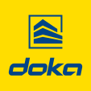
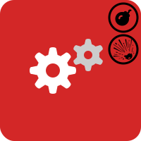
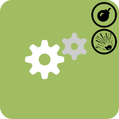
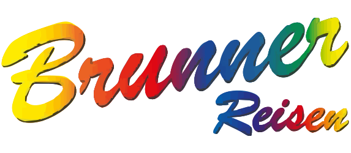

  
  <!-- Dynamic Typing Headline -->
  

## 📫 Let's Connect

---

## 📊 GitHub Stats

---

## 💼 Work Experience

##    Doka Group

 &nbsp; **"DISCOS" = Doka's modified Axapta 2009**

* 💰 **Understanding** the **business logic**

- 🕵 **Troubleshooting** and **fixes (improvements)** in various **areas**

* 🆒 **Development** of **custom X++ Jobs** and **Forms**

 **1st and 2nd Level IT Support (Console Helpdesk):** 

*  **Processing** over **100 tickets** in the first **2 months** ranging from **user errors** to **company customizing issues**

-   **Customer/client contact** in **English** with **people from all over the world 🌍** - *"❤️ Personal Favorite"*

*  **Collaboration** with the **Business-Application IT**: **troubleshooting** for **data transfer** via **xml interfaces**, **bugfixing** in **X++ code**

-  **Learning** various **programs** from other **departments** for the **ERP system migration** (**SAP**, **PIM/PPM**, **MDM**)

 **Development** of a **[Screenshot Tool](https://github.com/Ezellhof/DOKA-ScreenShotTool)** in **PowerShell**

---

##   Bgo Holding

* 🚛 **Planning** and **coordination** of **transfer** and **delivery trips** in **Austria** & **Germany** & **Switzerland**

- 🎓 **Learning** **2 CMS software products** (Profi-Tour & Cargo-Support) for the **IT migration** of one of our **furniture manufacturers**

* 💻 **Collaboration & Consulting** with the **Business-Application IT** and **Dispatchers** as a **KeyUser**

- 🧾 **Development of automated document solutions** (tour summary sheets, waybills) using **SQL queries**, **report designer**, and **VBA scripts**

* 💁 **Cross-departmental exchange** with **transport** and **assembly partners** throughout **Austria** (business trips by car)

<a href="https://github.com/BMLZellEr/bgo_montage_und_logistik"><picture><source media="(prefers-color-scheme: dark)" srcset="assets/github-button-dark.svg"></picture></a>&nbsp;&nbsp; **Development** of various **[Scripts](https://github.com/BMLZellEr/bgo_montage_und_logistik/tree/main/excel-makros)** and a **[Dispatcher-Map](https://bmlzeller.github.io/bgo_montage_und_logistik/austria_cargo_zone_map/index.html)** 

---

##  Norbert Brunner GmbH

* 🚍 **Fleet management**, **planning & coordination** of **buses** for **travel**, **line (rail replacement)**, and **school transport**

- 📊 **Management** of a **small business** including **job interviews** and **financial** and **work planning**

* 📆 **Service**, **repair**, and **appointment scheduling**

- 🚌 **Assignment** and **evaluation** of **driving times** using **DAKO system**

* 💸 **Customer service** and **procurement**

- 🖨️ **Small business IT infrastructure**: **Linux server** with **SMB shares**, **Windows backups**, **network infrastructure**, **password management**, **CCTV**, **user permissions**, **Microsoft SQL**

---

##    Cryptocurrency Mining

*  **Management** of **Linux PCs** for **distributed computing**

-  **Multi-GPU Linux workstation builds & driver installation**

*   **Integration** of **Google Cloud API** in **Bash scripts**

-  **Development** and **maintenance** of an **SQL database** (MariaDB) for **hashrate**, **fiat value**, and more

---

## 🧑‍🏫 Civil Service: "Kidsnest"

* 🤹 **Working** with **troubled youth**, cooking, shopping

---

##  Internship Wittur

* 🔌 **Electrical work** and **IT work** (cable assembly, logistics, Excel, wiring of elevator circuits)

---

## 🎓 Education

**High School** | **HTL** | 09/2014 – 07/2019

**Middle School** | **Hauptschule** | 09/2010 – 07/2014

**Primary School** | **Volksschule** | 09/2006 – 07/2010

---

## 🛠️ Tech Stack & Tools

| Category | Technologies |
|----------|-------------|
| **💻 Operating Systems** |    |
| **⚙️ VM's & Containers** |    |
| **📊 Corporate** |       |
| **💾 Databases** |     |
| **🌐 Web Technologies** |    |
| **📃 Scripting** |   |
| **🔧 Tools** |    |

---

## 🌍 Languages & Additional Information

🇩🇪 **German** (Native)
 
🇬🇧 **English** (Fluent)

🚗 **Driver's License**

✈️ **Willingness to travel** 💯

---

## 🎯 Interests

Technology, Travel, Foreign Cultures, Tennis, New Challenges, Customer Contact

---

  

