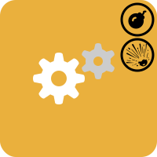

  

  
  <!-- Dynamic Typing Headline -->
  

## 📫 Let's Connect

---

## 📊 GitHub Stats

---

## 💼 Work Experience

##    Doka Group

 &nbsp; **"DISCOS" = Doka's modified Axapta 2009**

* 💰 **Understanding** the **business logic**

- 🕵 **Searching** for **Bugs** and **Troubleshooting/Fixing** in various **Buisness-Areas** in the **ERP-System**

* 🆒 **Development** of **custom X++ Jobs** and **Forms**

 **1st and 2nd Level IT Support (Console Helpdesk):** 

*  **Processing** over **100 tickets** in the first **2 months** ranging from **user errors** to **company customizing issues**

-   **Customer/client contact** in **English** with **people from all over the world 🌍** - *"❤️ Personal Favorite"*

*  **Collaboration** with the **Business-Application IT**: **troubleshooting** for **data transfer** via **xml interfaces**, **bugfixing** in **X++ code**

-  **Learning** various **programs** from other **departments** for the **ERP system migration** (**SAP**, **PIM/PPM**, **MDM**)

###  **Development** of a **[Screenshot Tool](https://github.com/Ezellhof/DOKA-ScreenShotTool)** in **PowerShell**

---

##   Bgo Holding

* 🚛 **Planning** and **coordination** of **transfer** and **delivery trips** in **Austria** & **Germany** & **Switzerland**

- 🎓 **Learning** **2 CMS software products** (Profi-Tour & Cargo-Support) for the **IT migration** of one of our **furniture manufacturers**

* 💻 **Collaboration & Consulting** with the **Business-Application IT** and **Dispatchers** as a **KeyUser**

- 🧾 **Development of automated document solutions** (tour summary sheets, waybills) using **SQL queries**, **report designer**, and **VBA scripts**

* 💁 **Cross-departmental exchange** with **transport** and **assembly partners** throughout **Austria** (business trips by car)

### <a href="https://github.com/BMLZellEr/bgo_montage_und_logistik">

| Category | Technologies |
|----------|-------------|
| **💻 Operating Systems** |    |
| **⚙️ VM's & Containers** |    |
| **📊 Corporate** |       |
| **💾 Databases** |     |
| **🌠Web Technologies** |    |
| **📃 Scripting** |   |
| **🔧 Tools** |    |

---

## 🌍 Languages & Additional Information

🇩🇪 **German** (Native)
 
🇬🇧 **English** (Fluent)

🚗 **Driver's License**

✈️ **Willingness to travel** 💯

---

## 🎯 Interests

Tennis, Technology, Travel, Foreign Cultures, New Challenges, Customer Contact

---

  

